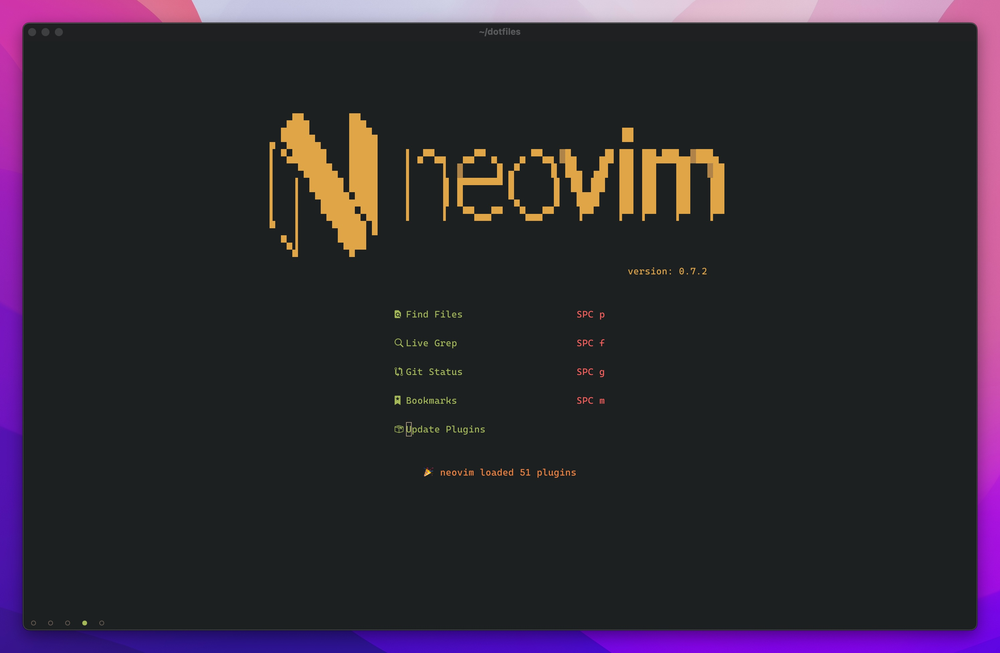
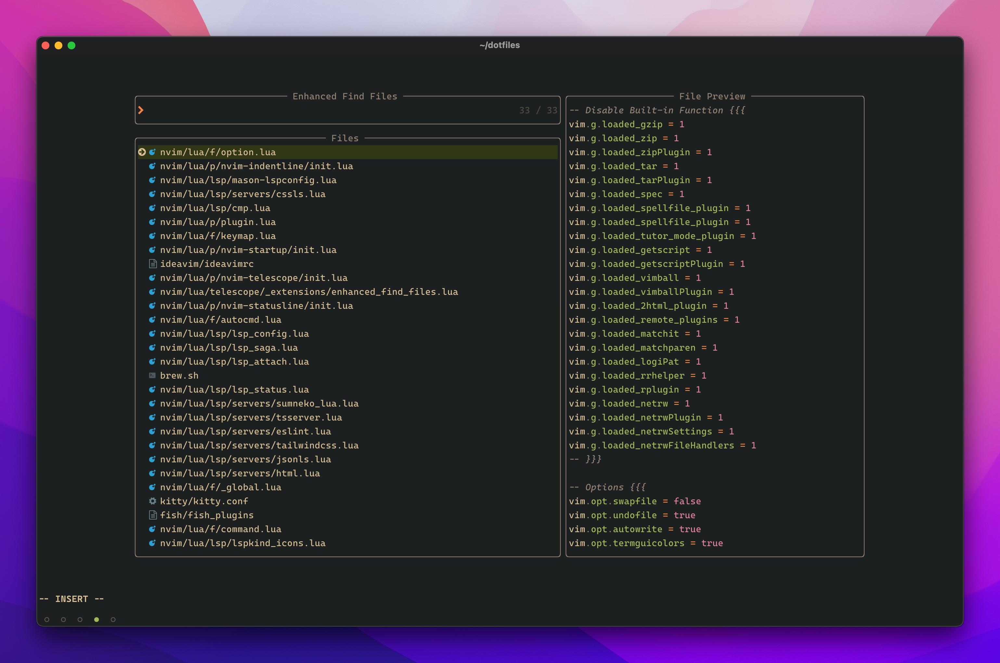
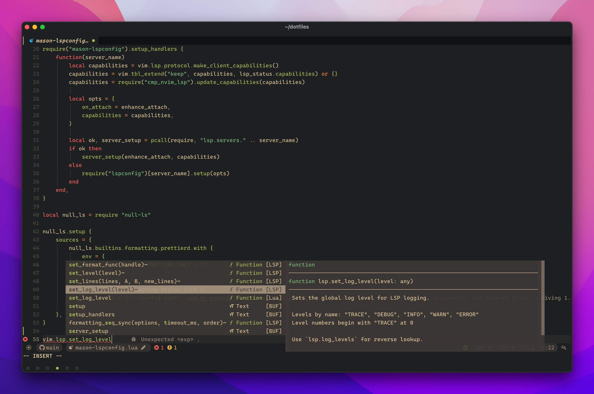

# Neovim

|           |                Preview                |
| :-------: | :-----------------------------------: |
|  Landing  |  |
|  Editor   |         |
| Telescope |        |
|    LSP    |              |
|    LF     |                 |
|  Lazygit  |       |

# Terminal Environment

Yes, Kitty & Fish.

- Terminal: [Kitty](https://github.com/kovidgoyal/kitty)
- Shell: [Fish](https://fishshell.com/)
- Fonts: [Cascadia Code PL](https://github.com/microsoft/cascadia-code/releases)
- Colorschema: [Gruvbox Material](https://github.com/sainnhe/gruvbox-material)
- [Tmux](https://github.com/tmux/tmux)
- [Lazygit](https://github.com/jesseduffield/lazygit)
- [Lf](https://github.com/gokcehan/lf)
