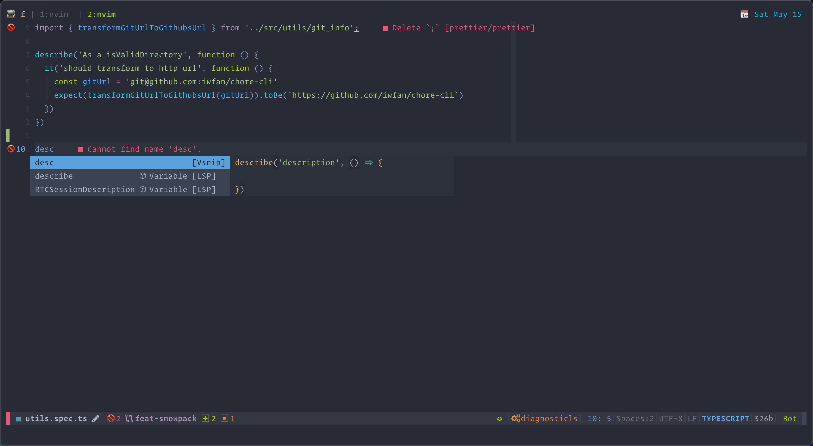

# Neovim

# Terminal

- Kitty
- iTerm2

# fonts

- Cascadia Code PL
- FireCode Nerd Font Retina
- JetBrains Mono

# colorschema

- Gruvbox Material Medium
- Snazzy

# references vim configuration

- https://github.com/lervag/vlugins
- https://github.com/siduck76/neovim-dotfiles/
- https://github.com/iamcco/dotfiles
- https://github.com/KyleJKC/nvim
- https://github.com/ctaylo21/jarvis
- https://github.com/hardcoreplayers/ThinkVim
- https://github.com/Shougo/shougo-s-github
- https://sourcegraph.com/github.com/voldikss/dotfiles
- https://nathansmith.io/posts/neovim-lsp
- https://rishabhrd.github.io/jekyll/update/2020/09/19/nvim_lsp_config.html
- https://github.com/tjdevries/config_manager
- https://github.com/awesome-streamers/awesome-streamerrc/blob/master/ThePrimeagen/init.vim
- https://github.com/nathunsmitty/.config/tree/master/nvim
- https://github.com/siduck76/neovim-dots
- https://github.com/rockerBOO/dotfiles/tree/current/config/nvim/lua
- https://phelipetls.github.io/posts/configuring-eslint-to-work-with-neovim-lsp/

- https://github.com/LunarVim/LunarVim
- https://www.locatelli.dev/nv-ide/
- https://github.com/NvChad/NvChad
- https://github.dev/mhartington/dotfiles
