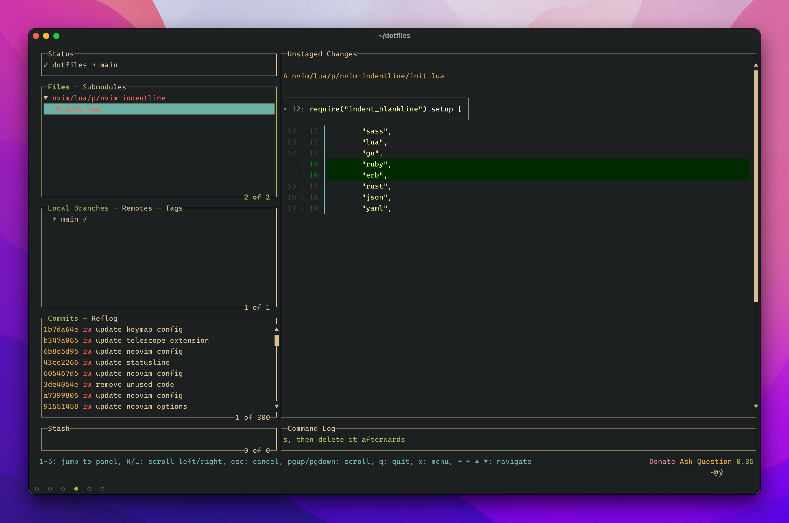

# Neovim

|         |              Preview                 |
| :-----: | :----------------------------------: |
| Landing |  |
| Editor  |        |
| LSP     |              |
| LF      |                |
| Lazygit |      |

# Terminal Environment

- Terminal: [Kitty](https://github.com/kovidgoyal/kitty)
- Fonts: [Cascadia Code PL](https://github.com/microsoft/cascadia-code/releases)
- Colorschema: [Gruvbox Material](https://github.com/sainnhe/gruvbox-material)
- [Tmux](https://github.com/tmux/tmux)
- [Lazygit](https://github.com/jesseduffield/lazygit)
- [Lf](https://github.com/gokcehan/lf)

# references

- https://github.dev/ecosse3/nvim
- https://github.com/LunarVim/LunarVim
- https://www.locatelli.dev/nv-ide/
- https://github.com/NvChad/NvChad
- https://github.dev/mhartington/dotfiles

- https://github.com/siduck76/neovim-dotfiles/
- https://github.com/KyleJKC/nvim
- https://github.com/nathunsmitty/.config/tree/master/nvim
- https://github.com/siduck76/neovim-dots
- https://github.com/rockerBOO/dotfiles/tree/current/config/nvim/lua
