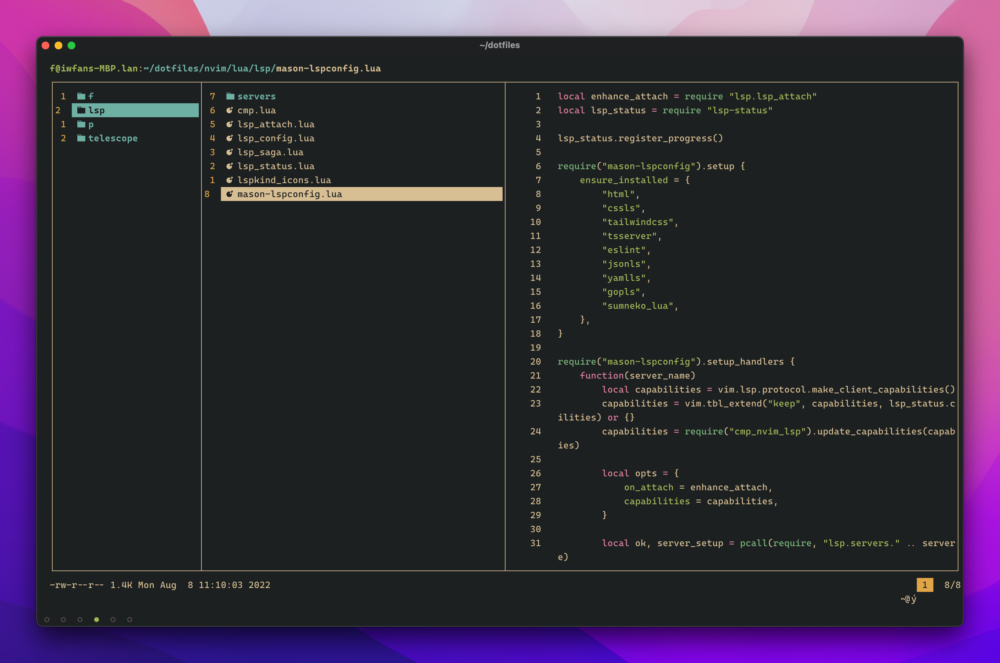

# Neovim

|           |                Preview                |
| :-------: | :-----------------------------------: |
|  Landing  |  |
|  Editor   |         |
| Telescope |        |
|    LSP    |              |
|    LF     |                 |
|  Lazygit  |       |

# Terminal Environment

Yes, Ghostty & Zsh.

- Terminal: [Ghostty](https://github.com/ghostty-org/ghostty)
- Shell: [Zsh](https://www.zsh.org/)
- Fonts: [Maple Mono NF CN](https://github.com/subframe7536/maple-font)
- Colorschema: [Everforest](https://github.com/sainnhe/everforest)
- [Tmux](https://github.com/tmux/tmux)
- [Lazygit](https://github.com/jesseduffield/lazygit)
- [Yazi](https://github.com/sxyazi/yazi)

https://github.com/mikesmithgh/kitty-scrollback.nvim
